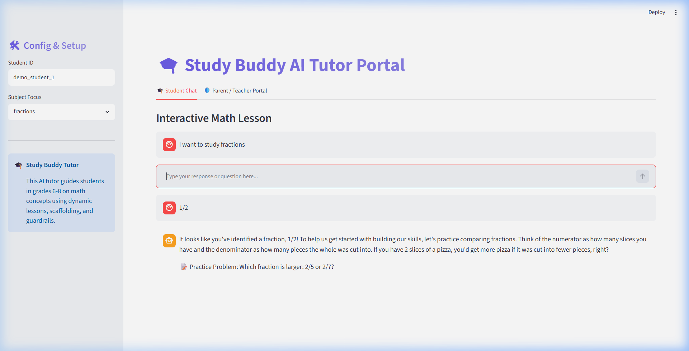

# Walkthrough - Study Buddy Security & UI Portal

This walkthrough details our session finalization trigger, PII scrubbing checkpoints, local CSV logging database fallback, and the interactive Streamlit Chat & Audit UI.

## 1. Interactive Streamlit UI Portal
We built a premium, minimal Streamlit chat interface inside [app_ui.py](app_ui.py) to enable video demo walk-throughs:
- **🎓 Student Chat Tab**: Enables interactive chat messaging with the live tutoring agent, selectbox subject configurations (`fractions` or `decimals`), and live status alerts when messages trigger the safety review thresholds.
- **🛡️ Parent / Teacher Portal Tab**:
  - **Safety Auditing Dashboard**: Fetches and lists pending high-risk flagged reviews from the encrypted `reviews.json` database. Allows the parent/teacher to "Approve" or "Reject" student turns, calling `record_parent_decision` and automatically resuming or blocking the suspended workflow session.
  - **Decrypted Historical Audits**: Table displaying all historical safety evaluations.
  - **Session Progress Logs**: Table displaying the PII-scrubbed summaries logged in `progress_log.csv` (recording student_id, date, and accomplishments).
- **✨ Clean Output Filtering**: Resolved GenAI intermediate node outputs leakage (such as raw JSON logs from `tutor_agent` or `guardrail_agent`) by filtering event streams. The chat interfaces now selectively capture and render only content emitted by the `output_sender` node.
- **🔄 Session Resumability**: Correctly wired student quiz response resumptions and parent approval resumptions using standard GenAI `types.Content` and `types.FunctionResponse` parts compatible with the sync `Runner.run()` signature.



### Live Google Cloud Run Deployment
The interactive web portal is deployed and running live on Google Cloud Run:
* **Interactive Live Demo URL**: **[https://studybuddy-tutor-112080613832.us-central1.run.app](https://studybuddy-tutor-112080613832.us-central1.run.app)**

You can redeploy or launch the container deployment manually using:
```bash
gcloud run deploy studybuddy-tutor --source . --region us-central1 --allow-unauthenticated
```

To run locally for testing:
```bash
uv run streamlit run app_ui.py
```

---

## 2. PII Scrubbing Boundary & Limitations
Implemented a regex-based PII scrubber (`scrub_pii`) protecting students' privacy before data leaves the system boundary:
- **Input Checkpoint**: Inside `parse_input_node`, all incoming student messages are scrubbed of email addresses, phone numbers, common name disclosures, and US street addresses. The database, context state, and conversation histories are stored in their redacted forms.
- **Output/Logging Checkpoint**: Inside `progress_node` and our background finalization scheduler, the generated summaries are scrubbed of any PII to ensure log databases remain clean.

### Honest Limitations:
> [!IMPORTANT]
> Name detection and address recognition without a heavy NLP-based Named Entity Recognition (NER) model is a best-effort pass. While the regex patterns capture common intro phrases ("my name is X", "I'm X", "I live at/on X") and standard US street structures (digits + street name + standard suffix like St/Ave/Rd), it may not capture un-introduced names or non-standard international address formats. A production-ready app should deploy a dedicated transformer model (e.g. presidio-analyzer) for exhaustive coverage.

---

## 3. Local CSV Database Fallback
For the local demo, we chose to write to a local CSV file at `app/data/progress_log.csv` rather than configuring full Google Sheets API/OAuth MCP infrastructure, enabling seamless local execution:
- Appends clean columns: `(student_id, date, summary)`.
- Restricts logged summaries to PII-redacted text representations.

---

## 4. Ambient Background Inactivity Trigger
Implemented a non-blocking background daemon thread to detect and finalize idle conversations:
- **Tracking**: Every incoming message updates `SESSION_ACTIVITY[student_id] = time.time()`.
- **Finalization Check**: Spawns a background thread polling session states. If no message is received for `IDLE_TIMEOUT_SECONDS` (configurable via env, default 5 minutes), the session is popped and mapped to the background progress generator thread.
- **Model Call**: Direct asynchronous client call generates the summary payload using the `SummaryOutput` schema without interrupting ongoing active student threads.

---

## 5. Completed Test Suite Execution

Our outcome-based test suite is defined in [test_agent.py](tests/test_agent.py).

Run tests:
```bash
uv run pytest tests/test_agent.py
```

### pytest Execution Log
```
============================= test session starts =============================
platform win32 -- Python 3.13.0, pytest-9.1.1, pluggy-1.6.0
rootdir: d:\Capstone Project 2\studybuddy-agent
collected 15 items

tests\test_agent.py ...............                                      [100%]

============================= 15 passed in 5.29s ==============================
```
All 15 outcome-based validation assertions pass successfully.

---

## 6. Greeting & Out-of-Scope Intent Routing
To prevent the tutor from forcing students directly into diagnostic quizzes or math lessons when they engage in small talk or ask general questions:
- **Greeting Node**: Detects general introductions (like "hi", "hello") and routes to a welcoming conversational node that prompts the student to choose between Fractions and Decimals.
- **Out of Scope Node**: Politeness boundary that intercepts out-of-scope math (e.g. "1+1=3") or general queries (e.g. history, coding) and redirects the student back to our core fractions and decimals subjects.
- **Improved Intent Classifier**: Expanded `IntentVerdict` to support `greeting` and `out_of_scope` categories, ensuring proper workflow orchestration.
